<h3>Installation de Ollama </h3>
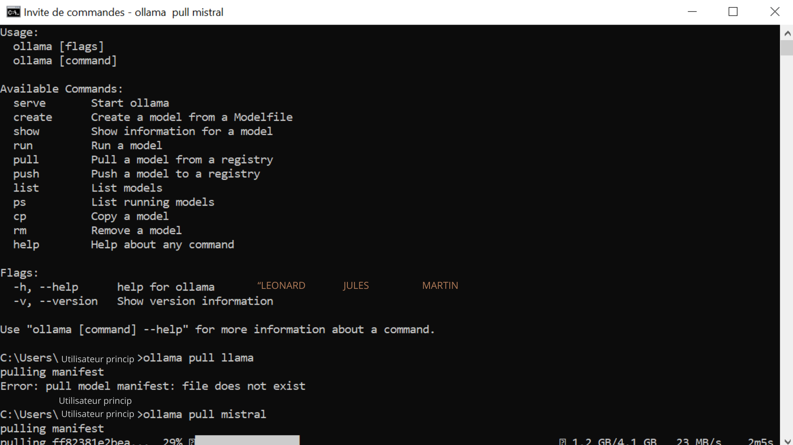
<h3>Test de Ollama</h3>
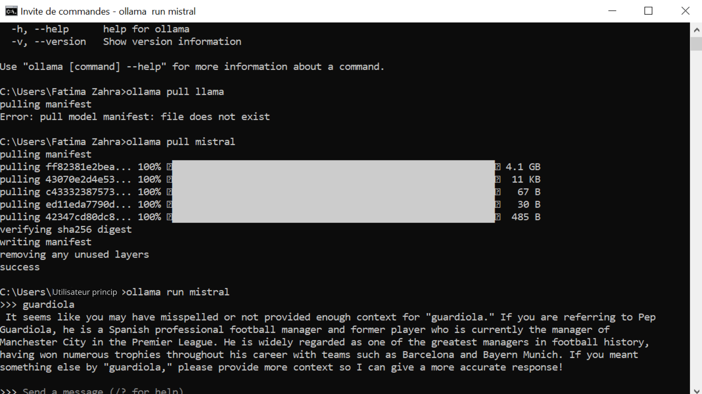
<h3>Test1</h3>
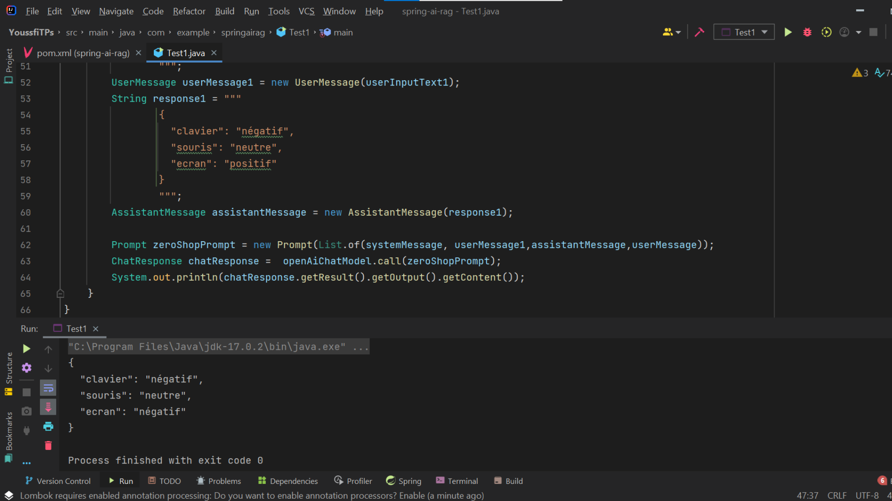
<h3>Test2Lliama</h3>
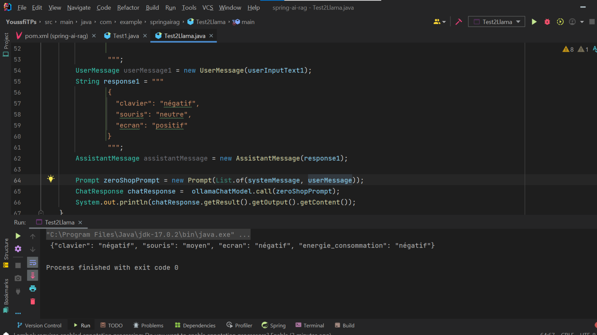
<h3>Open IA (question)</h3>
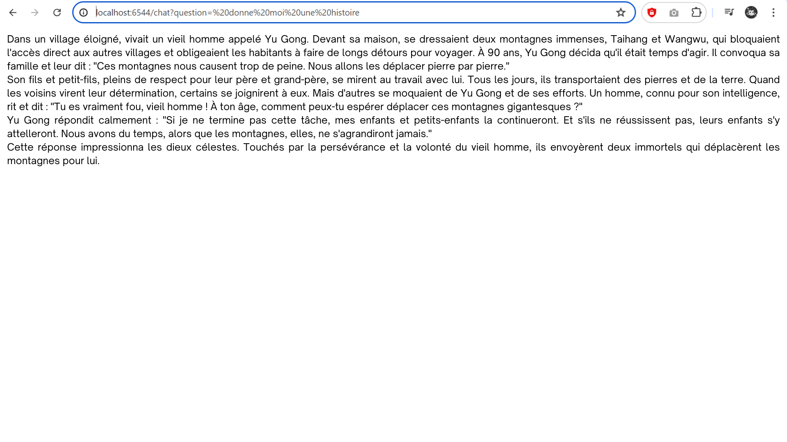
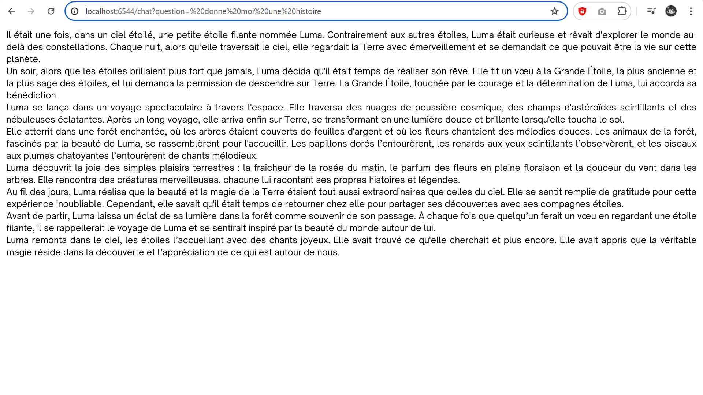
<h3>Open IA (sentiment )</h3>
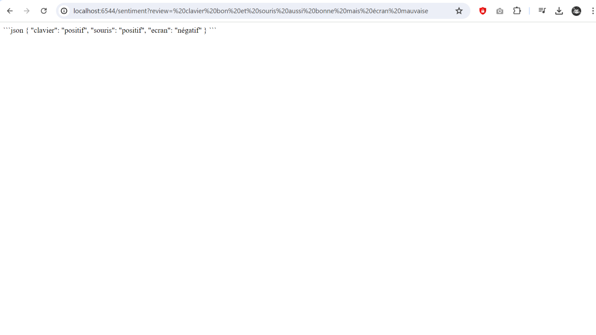
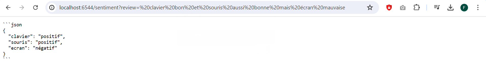
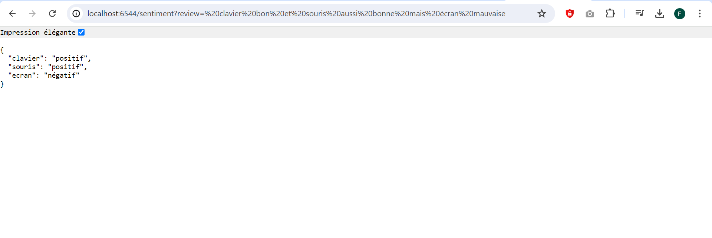
<h3>Open IA (swagger )</h3>
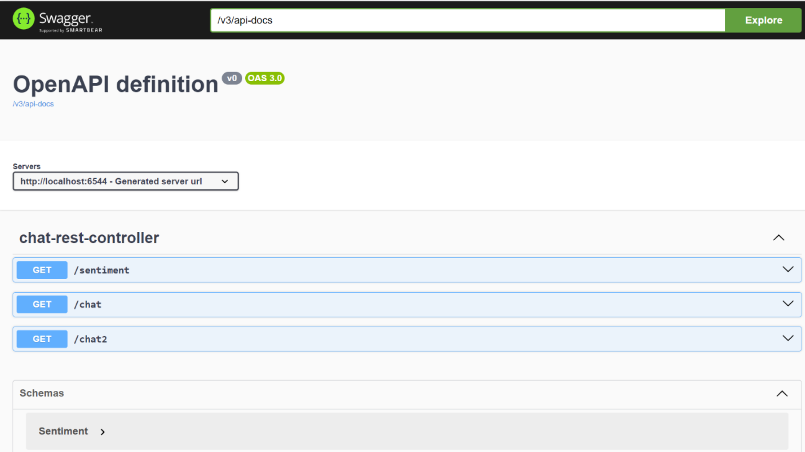
<h3>Open IA (swagger GET)</h3>
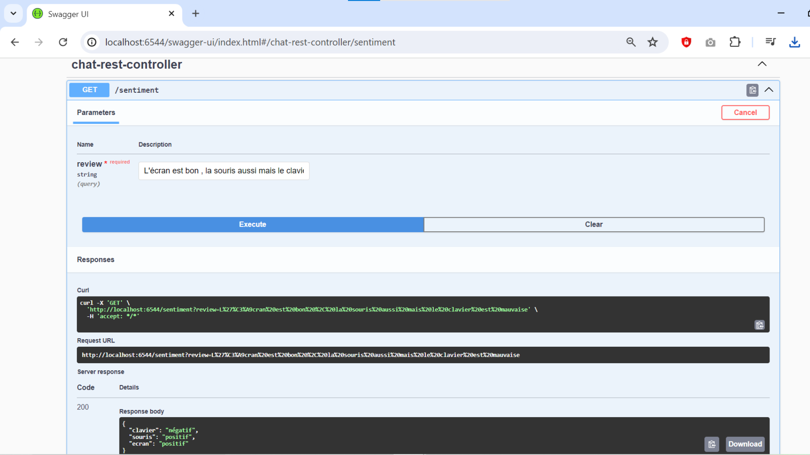
<h3>Open IA (swagger POST)</h3>
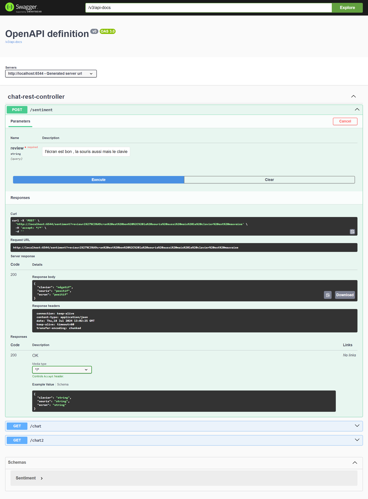
<h3>Open IA (swagger GET)</h3>
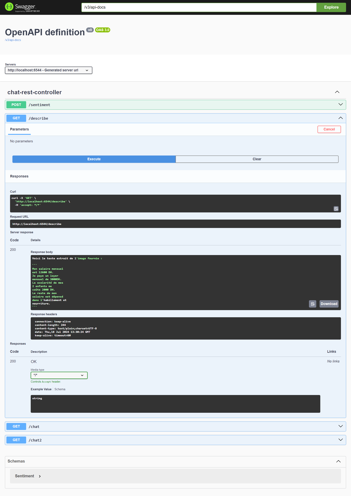
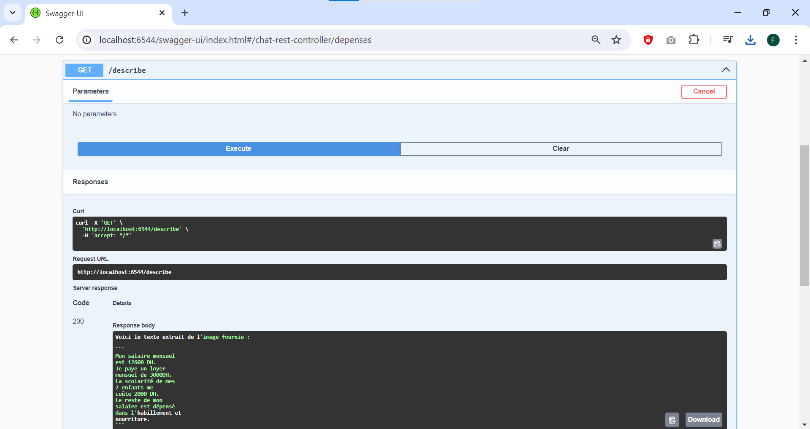
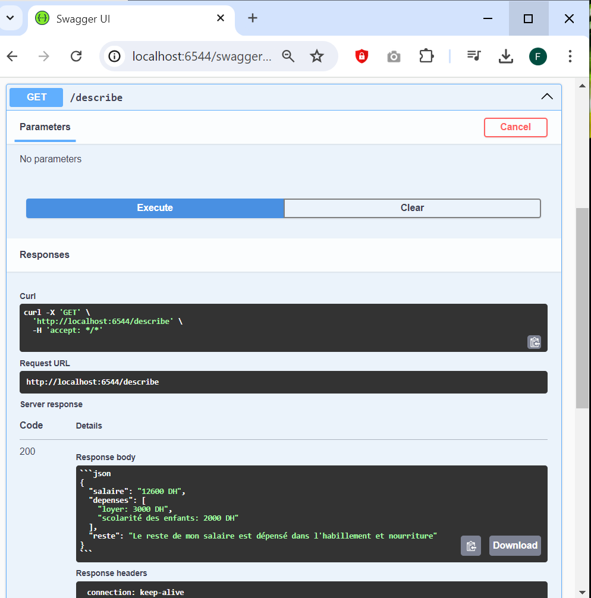
<h3>Open IA (generer une photo)</h3>
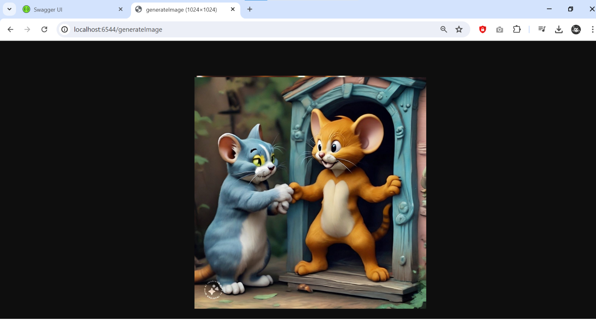

